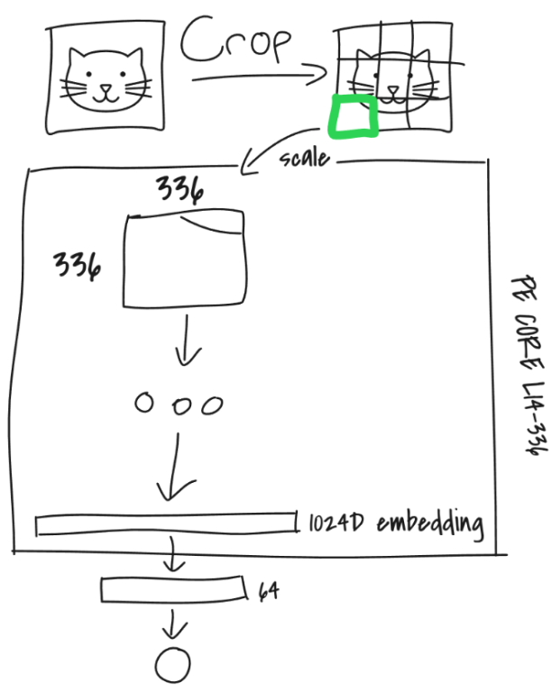
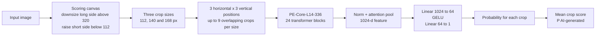
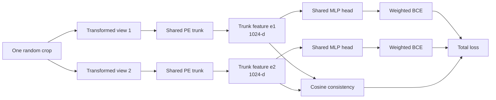
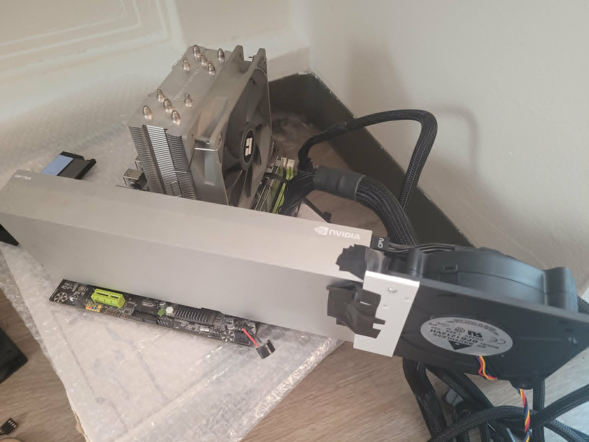

# Robust AI-Generated Image Detection

<p align="center">
  
  <br>
  <sup><em>Crop-and-classify architecture sketch</em></sup>
</p>

## Objective

This project explores a practical question: can we tell whether an image is authentic or
AI-generated after it has been reposted or lightly edited? A detector may work well on an original
file and still struggle once compression, blur, resizing, or cropping removes some of the clues it
relies on. Our aim is to make that drop as small as possible.

### Transformation setup

For the robustness check, we use six transformation families:

| transformation | settings used |
|---|---|
| JPEG compression | quality 90, 70, 50, and 30 |
| Gaussian blur | σ 0.5, 1.0, and 2.0 |
| Resize down and back up | scale 0.5× and 0.25× |
| Gaussian noise | σ 0.02, 0.05, and 0.10 |
| Colour adjustment | brightness, contrast, and saturation raised together by 20% |
| Centre crop | keep the central 80% |

We test these both one at a time and in seeded stacks of distinct families. A depth-six example has
passed through all six families once, which is closer to the kind of accumulated damage an image
might pick up through several reposts. The colour-adjustment cell is our current deterministic
implementation; it does not cover every positive and negative 20% combination from the brief.

## Strong result

The shipped `canon6_AlowLR` model held up encouragingly in these tests:

- **Clean AUROC:** 0.9999
- **Mean AUROC over 14 implemented single-transform conditions:** 0.9995
- **Worst single-transform AUROC:** 0.9982
- **Six distinct transform families stacked:** 0.9968 AUROC

At one cutoff calibrated on the pooled clean-plus-stacked evaluation distribution, it caught
**98.8% of the AI images after all six transform families were composed**, while flagging
**2.6% of the real photographs** in that depth-six condition. This is a small reference-set
experiment rather than a claim about every image found in the wild, but it is a useful sign that the
model is not relying only on pristine-image artifacts.

## Architecture and intuition

### Intuition

Compression and blur change an image's pixels, but not what the image depicts. We therefore want
two transformed versions of the same crop to produce similar internal features. The classifier
still learns the real-versus-AI task, while an additional consistency loss discourages those
features from moving too far when the image is damaged.

### Model and prediction path

We fine-tune Meta's pretrained **PE-Core-L14-336** vision transformer (316.2M parameters)
(`vit_pe_core_large_patch14_336.fb` in timm). Its pooled 1024-dimensional feature is passed to a
small MLP head:



For inference, images larger than the scoring range are downsized so their long side is 320 px.
Very small inputs are brought up to the minimum 112 px short side. For **each** crop size, the crop
is placed at the left, centre, and right positions and at the top, middle, and bottom positions.
This gives up to 3 × 3 = 9 overlapping crops per size and up to **27 crop scores in total** across
112, 140, and 168 px. It is not a division into nine non-overlapping tiles. If an image dimension
is too constrained, some nominal positions coincide and the number of distinct regions is smaller.
The transformer accepts these crop sizes directly; they are not resized to 336 px.

The Gradio demo has a separate dense-sampling toggle for images whose original short side is above
640 px. When enabled, it may use a 4×4 through 7×7 grid per crop size, so the UI can display more
than 27 boundaries. That dense mode is not used for the reported benchmark results.

### Where the robustness loss is applied

Training starts with one random 112–168 px crop. Two different size-preserving transformation
chains are applied to that **same crop**, then both views pass through the same trunk and head:



The consistency term is calculated on the trunk's pooled **1024-dimensional feature**, after
`norm` and `attn_pool` but before the MLP classifier. This matters: it encourages the underlying
visual representation—not just the final probability—to stay similar across transformations.

```
classification = weighted mean BCE over both views
consistency    = mean(1 - cosine_similarity(e1, e2))
total loss     = classification + 3.0 * consistency
```

Real images have classification weight 2 and generated images weight 1. Independently for each
view, there is a 40% chance of applying a stack of two to five distinct size-preserving transform
families; otherwise the regular path applies zero to two transformations.

### What is trained

The shipped model is fine-tuned **end to end**: no trunk layer is frozen. Patch and position
embeddings, all 24 transformer blocks, normalization, attention pooling, and the MLP head are
trainable. The trunk is kept close to its pretrained state through its small learning rate rather
than by freezing it.

| component | trainable? | learning rate |
|---|---|---:|
| Entire PE trunk | yes | **2e-6** |
| New MLP head: 1024 → 64 → 1 | yes | **1e-3** |

This gives the randomly initialized head room to learn quickly while updating the pretrained trunk
much more gently. The low-LR consistency configuration performed best in our robustness comparison,
although it changes both the trunk LR and consistency weight relative to the normal-LR run, so the
experiment does not isolate either choice on its own.

<p align="center">
  
  <br>
  <sup><em>Our hacked together training machine 🥀</em></sup>
</p>


## Dataset

The final `canon6` corpus combines public real and generated images from WildFake, ArtiFact, and
additional public sources. The training split contains **100,204 images**—50,102 real and 50,102
generated—from 25 generator families. Validation is also balanced, with 12,502 images, while the
larger held-out test split contains 157,673 images from 33 generator families.

Image size and subject matter created strong shortcuts in earlier versions of the data, so the final
corpus is balanced by class inside native-size buckets and checked for label, content, and duplicate
leakage. Partial edits, DDPM, and DDIM are held out of training. The contest reference data—COCO
val2017 real photographs and DALL·E Advanced images—is used only for evaluation and appears in no
training or validation rows.

## Setup and run

```bash
git clone https://github.com/wheres-my-perry/techjam-2026-track5.git
cd techjam-2026-track5

python3 -m venv .venv
source .venv/bin/activate

pip install -r requirements.txt
pip install -r requirements-train.txt
```

`requirements.txt` is enough for inference, the Gradio demo, and tests.
`requirements-train.txt` adds the dataset and training tools. HEIC/HEIF loading is optional; install
`pillow-heif` when those formats are needed.

Download the shipped checkpoint:

```bash
mkdir -p outputs/pe_ft
curl -L -o outputs/pe_ft/canon6_AlowLR.pt \
  https://github.com/wheres-my-perry/techjam-2026-track5/releases/download/canon6-v1/canon6_AlowLR.pt
```

Score every supported image under a directory:

```bash
python -m src.predict --input <image_dir> --output preds.json \
  --model "vote(L=320)+pe_ft:outputs/pe_ft/canon6_AlowLR.pt"
```

The output contains `image_path`, `pred` (P(AI-generated)), and a binary `label` for each image.
The default decision threshold is 0.5. To launch the interactive crop and transformation demo:

```bash
python app.py
```

## What we saw under repeated transformations

Single-transform results use a 900-image DALL·E-3-versus-COCO reference subset. The stacked-depth
comparison uses a separate 400-image subset containing 248 AI and 152 real images. Neither subset
was used for training.

| condition | AUROC |
|---|---:|
| Clean images | **0.9999** |
| Mean over 14 single-transform conditions | **0.9995** |
| Worst single transform: Gaussian noise σ0.10 | **0.9982** |
| Six distinct transform families stacked | **0.9968** |

For the stacked-transform experiment, one threshold is selected per model from the pooled
clean-plus-stack-depth distribution and then held fixed across every depth:

| transform families stacked | 0 | 3 | 6 |
|---|---:|---:|---:|
| AI images caught | 99.2% | 98.4% | **98.8%** |
| Real images flagged | 0.0% | 0.7% | **2.6%** |

In this sample, ranking quality stayed strong even after several different kinds of damage were
combined. The product CLI and UI use a separate default threshold of `0.5`; the operating point
above belongs specifically to this robustness evaluation.

### What the comparison suggests

At maximum corruption, the seven-model comparison is:

| model | AI caught | Real flagged | Balanced accuracy |
|---|---:|---:|---:|
| **A+lowLR (`canon6_AlowLR`)** | **98.8%** | 2.6% | **98.1%** |
| A: trunk consistency, normal LR | 94.8% | 2.0% | 96.4% |
| MLP + partial-edit training data | 94.4% | 2.0% | 96.2% |
| B: consistency on a detached head layer | 94.0% | 3.3% | 95.3% |
| MLP baseline | 92.3% | 2.0% | 95.2% |
| B with stronger consistency | 92.7% | 2.6% | 95.1% |
| C: only the final trunk block trainable | 87.9% | 2.0% | 93.0% |

The clearest comparison is with the MLP baseline. At depth six, the shipped model caught **245 of
248 AI images**, while the baseline caught **229 of 248**—a difference of 6.5 recall points. It also
made one additional false alarm: 4 of 152 real images rather than 3. Its threshold-free AUROC was
higher as well (**0.9968 versus 0.9907**), which suggests that the difference is not only an effect
of where the cutoff was placed.

Taken together, the results suggest that a gently updated pretrained trunk and the consistency
objective work well as a combination. They do not isolate the learning rate as the only cause:
A+lowLR changes both trunk LR (1e-5 → 2e-6) and consistency weight (α 1 → 3) relative to A.
Likewise, the partial-edit model is a data experiment, not an architecture-only ablation. Finally,
each missed AI image changes recall by
about 0.4 points and each false alarm changes the rate by about 0.7 points, so differences of only
one or two images should not be over-interpreted.

## Further reading

- [Original Track 5 brief](docs/TRACK5_BRIEF_ORIGINAL.md)
- [Full robustness methodology and results](docs/ROBUSTNESS.md)
- [Error analysis](docs/ERROR_ANALYSIS.md)
- [Dataset defects and audit findings](docs/DATASET_DEFECTS.md)
