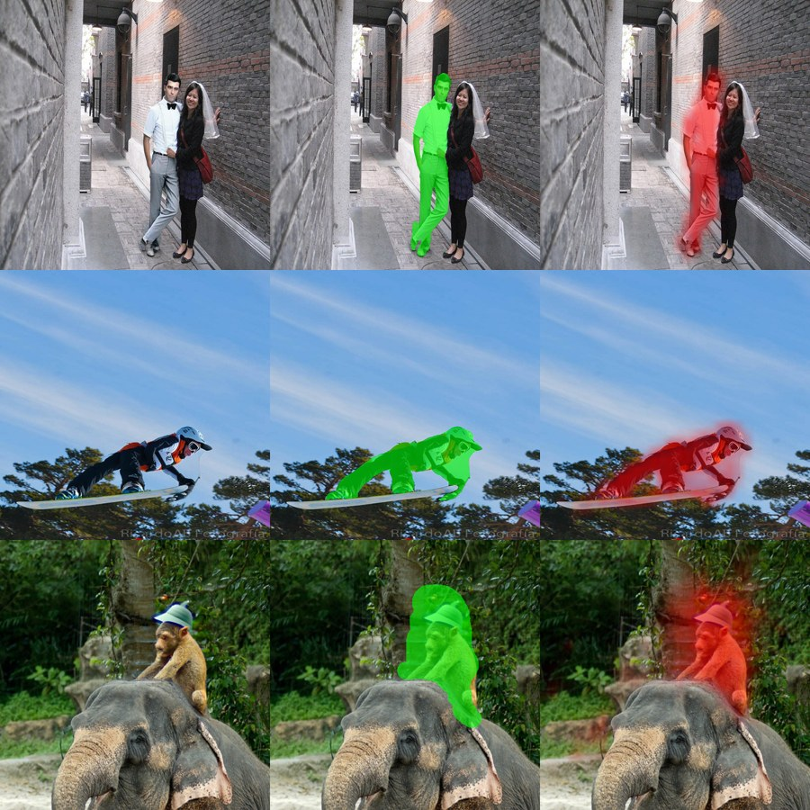

# Robust AIGC Detection — Findings & Results (living report)

Submission write-up in progress. Newest additions are appended in §9 with dates; the sections
above are kept current. Numbers are AUROC unless stated. Every number here passed the leak gates
(§2) before being written down; anything marked *suspect* has not.

## 1. What we built (one paragraph)

A detector for AI-generated images that stays accurate under real-world post-processing (JPEG,
blur, resize, noise, colour jitter, crop). Backbone: Meta's PE-Core-L14-336 vision transformer
(316M params, < 2B limit) fine-tuned on ~340K images from public sets, scored on the contest's
COCO-vs-DALL·E-3 reference benchmark **and** on a held-out "wild" set of unedited phone photos
and modern-generator images. Alongside the detector we ship (a) a benchmark-integrity toolkit
that catches dataset shortcuts before they become fake results, (b) a scale-neutral data recipe
that fixed a complete failure on real phone photos, and (c) a per-patch head that localises the
altered region in partially edited images.

## 2. Insight: why AIGC detectors lie, and how we stopped ours from lying

Every "too good" number we produced was traced to a shortcut. The gates below are now mandatory
before any result is reported (`scripts/shortcut_audit.py`, `canary_audit.py`, `content_audit.py`,
`bucket_audit.py`).

| shortcut we found | how it showed up | fix |
|---|---|---|
| **Image size = label** in the provided benchmark (COCO reals 200 px thumbnails vs DALL·E 1024+) | 0.99 AUROC from a model that only reads width/height | rebuilt benchmark at original resolution; canonical fixed-size crops for all data |
| **Folder name ≠ label** (ArtiFact) | 37% of our "fakes" were real photos | labels from per-image metadata only |
| **Content = label**: LSUN churches only real, bedrooms only fake | a 64-d colour model scored 0.75 | content audit; matched subjects per split |
| **Held-out generator leaked** into training (ddpm) | inflated "unseen generator" score | route to test only |
| **Benchmark images inside training** (COCO val2017 in ArtiFact) | contamination | official-slice guard |
| **Within-family transfer sold as generalisation** | 0.964 on an "unseen" diffusion model with its cousins in training | leave-one-*family*-out test: honest cross-family number is 0.72 |
| **Duplicate files in the reference benchmark** (DALL·E class: 8,843 files, 3,719 unique) | worst cases appeared as identical pairs | md5 de-duplicated manifest |
| **Every public training image is a small web thumbnail** (200–511 px) | model *inverted* on 5712-px phone photos (0/10 on a wild set) | shrink-first, per-size-bucket balanced data (§3) |
| **Colour/palette skew in the contest set** (colour-only model 0.78; the two classes are different photo collections, cannot be fixed by us) | would let a palette classifier look good | measured what our model reads instead: same images in **greyscale 0.979**, channels swapped 0.978, colour 0.995 — palette accounts for ≤0.016 of the score (canon3, 500+500 de-duplicated) |
| **Training reals overlap the contest reals?** (ArtiFact ships COCO train/test 2017; contest reals are COCO val2017) | would be memorisation, not detection | val2017 excluded from every split; perceptual-hash check of all 4,877 contest reals against the 17,014 COCO training reals: 0 exact, 1 near match |

Three of these (size, content, duplicates) are in datasets the community uses every day.


### 2.1 Finding: real and generated images differ in *style statistics* — partly intrinsic, partly aesthetic

A 12-number "style-only" model (brightness percentiles, contrast, saturation, grain, sharpness,
vignette, grey fraction — no layout, no palette) separates real from generated at **0.67 on our
training corpus and 0.77 on the contest reference set**. Where the classes differ (effect size):

```
property          training set: real  fake   effect     benchmark: real  fake   effect
brightness (95%)           0.808  0.769  -0.29                0.805  0.850  +0.38
contrast                   0.677  0.629  -0.31                0.691  0.740  +0.35
grain                      0.034  0.026  -0.47                0.035  0.034  -0.05
sharpness                  0.089  0.066  -0.49                0.110  0.093  -0.25
sharpness spread           0.119  0.088  -0.60                0.153  0.134  -0.28
grey fraction              0.272  0.277  +0.02                0.319  0.228  -0.40
```

Interpretation (Thinh, 2026-08-29): part of this is **intrinsic to generation** — generators have no
sensor, so no camera grain, and decoders are smooth — and a detector is entitled to use it. Part is
**aesthetic bias** (DALL·E outputs are brighter, more contrasty and more colourful than COCO photos
because of what people prompt for), which a detector should not rely on exclusively: the worst
cases in §6.1 are exactly a model leaning on it (flash-lit grainy DALL·E → "real"; polished real
photo → "AI"). We report it as a general property of AIGC data rather than a flaw of one dataset.

How we handle it in this prototype: (1) every DALL·E number is reported twice — on the
de-duplicated reference set and on a **style-matched subset** of it (each DALL·E image paired with
the COCO photo closest to it in the 12 style numbers; 1,107 pairs; style-only separability drops
0.77 → 0.60) — so the reader sees how much detection survives when style is equalised;
(2) full style neutralisation (label-neutral style randomisation on both classes, `--style-aug`,
and style-bucket balancing gated by the new `style` canary) is **built but out of scope** for the
submission, because the reference validation already scores high; it is the first item of future
work.

## 3. Data recipe: shrink first, balance every size bucket (Thinh, 2026-08-29)

Training on native-resolution crops looked principled but hid an assumption: that all images
arrive at the same scale. They don't. Rule now enforced by a gate: shrink every image by the
same deterministic rule (long side → 320) *before* the fixed 176-px crop, and require every
native-size bucket to contain both classes in equal numbers, so "was shrunk by factor f" can
never encode the label. Large-image sources added for this: SID_Set (real photos 1024×683 +
FLUX 1024²), CelebA-HQ, AFHQ, Open Images, FFHQ, Midjourney v6, SD-XL/SD-2.1/DeepFloyd (ELSA).

Effect, 10 minutes of training on a 53K-row subset (`canon3s`):

| | before | after |
|---|---|---|
| wild set (5 phone reals, 5 Gemini), AUROC | 0.00 (inverted) | 0.96 mean-vote / 1.00 top-3 |
| DALL·E-3 benchmark, mean over 14 transforms | 0.958 | 0.974 |
| DALL·E-3 benchmark, worst transform | 0.910 (resize 0.25×) | 0.938 (noise σ0.10) |

## 4. Model

**Global detector (`pe_ft`).** PE-Core-L14-336 fine-tuned end-to-end (trunk LR 1e-5, head 1e-3,
bf16), random-size crops 112–168 px shared by train and inference (no train/test mismatch),
augmentation drawn from the contest transform grid. Inference: 3×3 grid × 3 crop sizes = 27
crops, mean of crop scores (top-k / max evaluated; mean chosen on validation).

**Why a transformer (observation by Thinh).** We hypothesised that some fakes are exposed not by
local texture but by *relations between distant regions* (lighting, geometry, mutually
illogical parts), which convolution's local windows are structurally weak at and self-attention
directly models. On identical data and identical crop protocol the transformer backbone scored
far above the convolutional one:

| backbone | params | GENERAL score (ddpm holdout + DALL·E, mean over transforms) |
|---|---|---|
| ResNet-50 fine-tuned | 25M | 0.792 |
| PE-Core-L14 (ViT) fine-tuned | 316M | 0.964 |

Honest caveat: this is consistent with the relation hypothesis but is **not** a controlled test of
architecture alone — the two backbones also differ in size (13×) and pre-training (ImageNet vs
2B-image contrastive). A same-size CNN/ViT pair would be needed to isolate the attention effect.

**Does crop-averaging actually help?** Ablation on the de-duplicated DALL·E set (500+500, canon3
checkpoint, same weights, only the inference rule changes):

| inference | clean | jpeg q30 | blur σ2 | resize ¼ | noise σ0.10 | crop 80% | mean |
|---|---|---|---|---|---|---|---|
| 1 centre crop, 1 size | 0.988 | 0.967 | 0.951 | 0.938 | 0.954 | 0.987 | 0.964 |
| 9 crops (3×3 grid), 1 size | 0.996 | 0.985 | 0.978 | 0.974 | 0.979 | 0.993 | **0.984** |
| 27 crops (3×3 grid × 3 sizes) — shipped | 0.995 | 0.982 | 0.975 | 0.967 | 0.976 | 0.993 | 0.981 |

Averaging over a grid of crops is worth +0.02 on average and +0.03–0.04 on the hardest transforms
(blur, down-up resize); the three-size ladder adds nothing over one size (within noise). The gain is
in robustness, not in clean accuracy: a single crop can land on a blurred/flat region, the average
cannot.

**Localiser (`pe_seg`).** Same trunk, per-patch head (each 14×14 token predicts "altered"),
supervised by SID_Set's pixel masks; image score = mean of the top 5% patch logits, i.e. the
pooling is learned inside the transformer with full attention context instead of crop voting.
Mask-aware training crops; one crop size and one shrink factor for both classes.

## 5. Results

### 5.1 Reference benchmark (COCO val2017 vs DALL·E-3, never trained on; 1,200-image seeded subsample)

| transform | canon2 (old data) | canon3s (new data, 10-min trial) |
|---|---|---|
| clean | 0.985 | 0.985 |
| jpeg q90 / 70 / 50 / 30 | 0.988 / 0.984 / 0.977 / 0.966 | 0.983 / 0.984 / 0.980 / 0.973 |
| blur σ0.5 / 1.0 / 2.0 | 0.933 / 0.959 / 0.937 | 0.988 / 0.982 / 0.971 |
| resize 0.5× / 0.25× | 0.948 / 0.910 | 0.979 / 0.960 |
| noise σ0.02 / 0.05 / 0.10 | 0.976 / 0.961 / 0.925 | 0.979 / 0.967 / 0.938 |
| colour jitter 20% | 0.972 | 0.971 |
| centre crop 80% | 0.981 | 0.984 |
| **mean / worst** | 0.958 / 0.910 | **0.974 / 0.938** |

Standing caveat: the reference set fails our colour canary (DALL·E palette ≠ COCO palette, 0.755
from a 48-d colour model), so part of any score on it is palette. We report it because it is the
contest's reference; we do not tune on it.

### 5.1b Full retrain on canon3 (job 67, 4 epochs, 328K rows) — current model
Three views of the same DALL·E-3 reference benchmark, same checkpoint (`vote(L=320)+pe_ft:canon3.pt`):

| DALL·E-3 vs COCO set | n | clean | mean-TF (15 conditions) | worst |
|---|---|---|---|---|
| raw folder (contest files, 58% exact duplicates in the fake class) | 1,200 | 0.996 | 0.985 | 0.964 (resize 0.25x) |
| de-duplicated (md5) | 1,200 | 0.997 | 0.988 | 0.969 (resize 0.25x) |
| style-matched pairs (§2.1; 1,107 real/fake pairs) | 2,214 | 0.995 | 0.986 | 0.967 (resize 0.25x) |

Removing duplicates and equalising style change the number by < 0.01 in either direction, so the
score is not carried by repeated files or by aesthetic statistics. Every DALL·E number in this
report is therefore quoted as **0.996 clean / 0.985 mean-TF / 0.964 worst** (raw), with the
other two rows as the robustness check. Caveat that stays: the contest set fails the colour
canary (0.755), so part of any number on it is palette; we cannot fix contest data, only report it.

Other cells for the same checkpoint:
- **Wild set: 10/10 at the 0.5 cut-off** — phone photos 0.13–0.34, Gemini 0.68–0.97 — with no
  Gemini images in training. Without the shrink (`vote` at native size) the same weights score
  0.04 AUROC on this set: the shrink-first rule (§3) is the mechanism, not the extra data alone.
- **GENERAL 0.970** (mean of ddpm-holdout mean-TF and official mean-TF).
- Cross-family test (canon3_test, 8,000-row seeded subsample, 32 generators): clean 0.890 /
  mean-TF 0.861. The drag is entirely the tampering/inpainting generators that are test-only by
  protocol (generative_inpainting 0.68, lama 0.83, mat 0.88, sid_tampered 0.58): a 176-px crop of
  a partially edited image usually contains no edited pixels, which is exactly the case §5.3
  (`pe_seg`) exists for. Whole-image generators: 26 of 28 ≥ 0.97 clean, ddpm holdout 0.972/0.956,
  vqvae 0.905, glide 0.896.

Compared with the 10-minute trial (§5.1a): DALL·E mean-TF 0.974 → 0.985, worst 0.938 → 0.964,
wild real-photo scores 0.02–0.20 → 0.13–0.34 (still all below 0.5), Gemini 0.17 → 0.68–0.97.
The app and `scripts/score_dir.py` now use this checkpoint with the 0.5 cut-off.

### 5.2 Generalisation
- Leave-one-family-out (whole diffusion family removed from training): GENERAL 0.716 (DALL·E
  0.62, GLIDE 0.70, SD 0.59) vs 0.964 with cousins in training. Detectors key on the decoder
  type; hybrids with GAN/VQ decoders (vq_diffusion, diffusion_gan) stay at 0.99 even when
  "unseen".
- Wild set (phone photos + Gemini): §3. Gemini images still score low in absolute terms
  (max 0.17): Google's generator family is in no public dataset; ranking is correct, confidence
  is not.

### 5.3 Localisation of partial edits (`pe_seg`, held-out SID images, 2,458 never trained on)

| metric | value |
|---|---|
| image-level, tampered vs real | 0.996 |
| image-level, fully synthetic vs real | 1.000 (*suspect: synthetic are PNG, reals JPEG — format check pending*) |
| **patch-level, altered vs untouched region (against the mask)** | **0.984** |

Tampered and real are both JPEG in the held-out set, so the tampered number is not a format
shortcut. Heat-maps on held-out images (left: image, middle: ground-truth mask, right: prediction):



## 6. Error analysis (initial)
- **Unseen generator family (Gemini):** scored 0.08 median while FLUX/DALL·E/SD score 0.84–1.00.
  No threshold fixes this; only data from that family (or a close relative such as Imagen) can.
- **Real false-positive tail** lives in the small web-thumbnail corpus (19% of its reals > 0.2);
  large real photos are clean (1% of 1024-px reals > 0.2, 0% of COCO originals and phone photos,
  7% of pristine 2K DSLR photos). Operating threshold for large images can be ≈0.2.
- **Worst transform** is now noise σ0.10 (0.938); low-pass transforms are no longer the weak spot.
- **Partial edits** are missed by the global detector when the region is small (median altered
  area in SID is 8.8%); the localiser handles them (§5.3).


### 6.1 Worst cases on the reference benchmark (canon3s, 1,500 COCO + 1,500 DALL·E-3 originals, app policy)
Clean AUROC on originals 0.992; COCO reals: 1.2% score ≥ 0.2, 0.1% ≥ 0.5; DALL·E: 11.4% score < 0.2.
Contact sheets and the files: `outputs/error_analysis/` (worst.csv, FP_real_called_AI/, FN_dalle_called_real/).

**False positives (real photos called AI) — the model has partly learned "polished aesthetic = AI":**
1. heavily post-processed photos: saturated colour (magenta scissors 0.38, orange umbrella 0.35),
   HDR/painterly tone-mapping (sunset skyline 0.25, man in hat 0.23), black-and-white (elephants 0.48,
   soccer 0.32);
2. large flat, texture-less areas: jet in grey sky 0.32, foggy road 0.21, drawing on white paper 0.80
   (the single FP above 0.5 — a photo *of an illustration*);
3. studio lighting on dark backdrops (portrait with LED tie 0.25);
4. semantically odd real photos (levitating skateboard shoes 0.43).

**False negatives (DALL·E-3 called real, all < 0.02) — DALL·E imitating exactly the "real" cues:**
1. **amateur flash / film aesthetic**: dark party scenes with on-camera flash, grain, motion blur and
   drink splashes (8 of the 20 worst) — DALL·E's "candid phone photo" style is the hardest class;
2. **painting / illustration / vintage-poster / blueprint styles** (6 of 20): our reals include
   paintings (MetFaces, WikiArt-like content), so "AI in the style of an oil painting" reads as real;
3. **clean product renders** on plain backgrounds (typewriter, chairs, toy figures).
Also: the reference set's DALL·E class contains **exact duplicate files** — 8,843 files but only 3,719
unique (1,808 images appear 4×, byte-identical, under different date folders). The worst cases above
come in identical pairs for that reason. We now evaluate on a de-duplicated manifest
(`canon_official_dedup.csv`: 4,998 real / 3,719 fake); it changes the effective sample size, not the direction.

**Scope decision (Thinh, 2026-08-29):** AI images deliberately styled as paintings / illustrations /
vintage posters are an accepted failure class — at the pixel scale we work at they are indistinguishable
from a photo of a real painting, and they are not the misinformation case the brief targets. They stay in
the benchmark score but are not a training target. The candid / flash / film class *is* the target.

**Actionable:** (a) add flash/film/grain *reals* (phone photos at parties, film scans) and DALL·E-style
flash *fakes* so the aesthetic stops being a label; (b) add AI paintings/illustrations as fakes to
balance the painting reals; (c) style-balanced prompts in any self-generated set (the SDXL hard-fake
prompt bank already targets the candid/amateur cues).

## 7. Observation list — status

| observation / idea (docs/IDEAS.md) | status | evidence |
|---|---|---|
| Patch scoring + any-patch rule for tampered images | **have** (pe_seg, learned top-k pooling; hard max rejected on val) | §5.3 |
| Crop, don't resize (native-res crops) | have, then **corrected**: crop at *one shrunk scale* with balanced buckets | §3 |
| Long-range inconsistency → self-attention | **have** (PE ViT fine-tune) — hypothesis supported, not isolated | §4 |
| Relation head over patch features | not built (attention in the trunk covers it; not isolated) | — |
| Score stacking / ensemble | not built for the final model (earlier stacked baseline retired with the confounded data) | — |
| Artifact front-end (high-pass / SRM / DCT input) | not built | — |
| Explicit physics checks / VLM-as-judge | not built (out of 72 h scope) | — |
| Consistency-under-transform as a cue (a patch counts only if its verdict survives mild JPEG/blur) | measured once: real-crop false alarms 16% → 4.7%, no training; **not integrated** | 2026-08-29 |

## 8. Limitations
Out of scope by decision: AI images styled as paintings/illustrations/posters (roughly a third of the
11% of DALL·E-3 images scoring below 0.2). Reference benchmark has a palette confound we cannot remove; wild set is small (n=10) and
grows only with user-supplied images; unseen generator families (Gemini) are ranked correctly
but not confidently; pe_seg is trained on one tampering source (SID) and does not yet
generalise to wild images; per-crop inference (27 crops) costs ~0.1 s/image on an RTX 5090.

- Very large real photos are still the weak spot: 100 DIV2K 2K-px photos (never trained on) score
  median 0.17 but 22% cross the 0.5 cut-off (was 91% before the shrink-first data); the >1024-px
  bucket in training is thin. Phone photos (5/5) are fine but n is small.

## 9. Additions log
- 2026-08-30 (early): §4 crop-vote ablation (1 vs 9 vs 27 crops).
- 2026-08-30 (early): §2 two more shortcut checks (greyscale/channel-swap, train-vs-contest overlap), DIV2K limitation.
- 2026-08-30 (early): §5.1b final canon3 numbers (raw / dedup / style-matched DALL·E, wild, GENERAL 0.970, cross-family); app switched to canon3.
- 2026-08-29 (night): §2.1 style finding + matched benchmark; job 67 wild 10/10.
- 2026-08-29 (evening): §6.1 worst-case analysis on 3,000 reference originals.
- 2026-08-29: created; §2–§7 from the day's audits, small-trial retrain (job 64), LOFO (job 43),
  pe_seg first run (job 65). Full canon3 retrain (job 67) pending.
